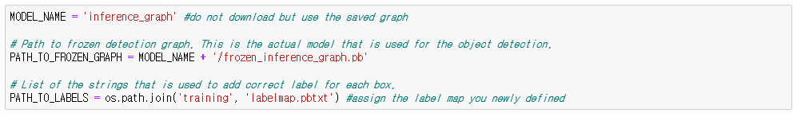

# EMedAI

## object detect and crop 
This folder mainly crops and processes the image after detecting PMS's front part.

The code is [object_detection_and_crop.ipynb](https://github.com/kristine4658/EMedAI/blob/master/object%20detect%20and%20crop/object_detection_and_crop.ipynb), 
which is a modified version of [object_detection_tutorial.ipynb](https://github.com/tensorflow/models/blob/master/research/object_detection/object_detection_tutorial.ipynb).
I just added few parts from the original code to extract characters from images more conveniently.
If you already trained data with model and have graph to use for object detection, place the file to 'models/research/object_detection.'
Keep in mind to set MODEL_NAME and PATH_TO_LABELS in your own as well as PATH_TO_TEST_IMAGES_DIR.

  

In order to use this code, you should move [visualization_utils.py](https://github.com/kristine4658/EMedAI/blob/master/object%20detect%20and%20crop/utils/visualization_utils.py)
also to 'models/research/object_detection/utils' as I newly add get_coordinates function to get coordinates of bounding box detected. 
The function will return list of 4 points, [ymin, xmin, ymax, xmax] in order.

The code appended can be explained mainly by 3 parts, Extract Coordinates and Crop, Filter and Image registration.

The first part simply obtain coordinates and apply those points to crop the image. 
To reduce the time spent for cropping images, you can use commented code instead, which use smaller image to extract the coordinates 
and then crop original image by multiplying rate from resized image to width and height of original. 

The second part is for filtering the image to make image registration more successful, unsharping method is applied. 
The third and last part is just image registration using orb algorithm. 

Unfortunately, as accuracy of filter and image registration part of this code is not high enough, use those two part only for the brief test.
Instead, follow the image processing tutorial explained below to improve image registration quality as well as character recognition level.

## Image Processing
This folder includes the codes and folders that are needed in order to enhance image registraction and character recognition level of PMS monitor. 

You can just run the codes following the steps to obtain the binary form of PMS image.

1. Run [prep.py](https://github.com/kristine4658/EMedAI/blob/master/Image%20Processing/prep.py) to eliminate vivid colors inside the monitor. Since image registration algorithm uses features of the picture, this code would help to reduce miss detection of feature at colored characters. Change the color range if needed.

  

2. Run [autoreg.py](https://github.com/kristine4658/EMedAI/blob/master/Image%20Processing/autoreg.py). The code includes 3 parts of unsharping, resizing of image and image registration. Unsharped image will be saved in 'midpro' folder, and using this proccessed image from 'midpro,' get warpPerspective and apply it to cropped image that is not filtered.

3. Run [detect_color.py](https://github.com/kristine4658/EMedAI/blob/master/Image%20Processing/detect_color.py) to extract each numbers by different colors. This will be used as annotation for PMS category. 

If you don't want to divide characters by colors, use [black_picker.py](https://github.com/kristine4658/EMedAI/blob/master/Image%20Processing/black_picker.py) and want to try different method of placing black circle inside the monitor to improve image registration level, use [prep2.py](https://github.com/kristine4658/EMedAI/blob/master/Image%20Processing/prep2.py)

